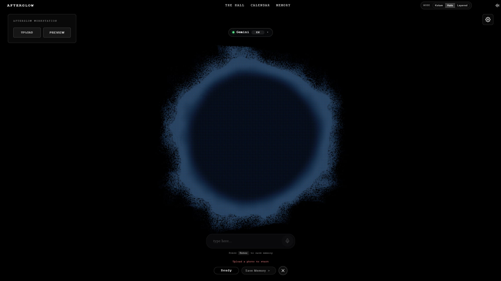
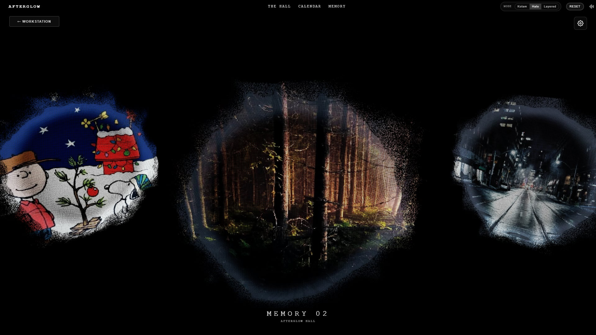
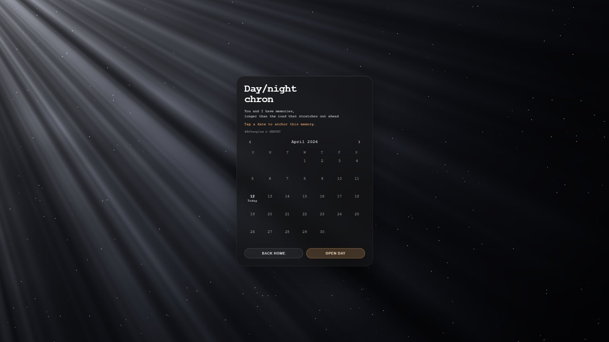

# Afterglow

A local-first memory palace app where photos dissolve into immersive 3D particle scenes, and AI helps you revisit and organize the stories behind them.

> Concept inspired by [秒秒Guo](https://www.xiaohongshu.com/user/profile/55a508e8c2bdeb432f5763e2) on Xiaohongshu. Fully implemented as a solo project.

**[→ Try the Live Demo](https://afterglow-44wh7wzan-noyolos-projects.vercel.app/)** (AI responses are mocked in the demo version)

---

## Default Particle Scene



## Photo Particle Effect — Street


## Photo Particle Effect — Forest


## The Hall — Memory Gallery



## Calendar



---

## What It Does

Upload a photo → it dissolves into thousands of particles in a WebGL scene → AI opens a conversation to help you recall and organize the memory → save it to your personal memory hall.

Every memory becomes a visual object you can revisit, browse by date, or explore in The Hall.

## Key Features

- **Photo-to-particle visualization** — uploaded photos decompose into interactive 3D particle clouds using Three.js
- **Multiple render modes** — Kolam, Halo, and Layered particle styles
- **AI-guided memory capture** — Gemini-powered conversational prompts help you articulate and organize memories
- **The Hall** — a gallery view of all saved memories as particle spheres
- **Calendar** — browse and retrieve memories by date
- **Voice input** — speak instead of type
- **Local-first storage** — all data saved in IndexedDB, no account required
- **Chinese / English toggle**

## Tech Stack

| Layer | Tech |
|-------|------|
| Frontend | Vite + Vanilla JS (ES Modules) |
| 3D Rendering | Three.js (WebGL) |
| Backend | Node.js + Express |
| AI | Google Gemini API |
| Storage | IndexedDB (local-first) |
| Deployment | Vercel (frontend) + Render (backend) |

## Why Vanilla JS

The core experience is a full-screen WebGL canvas driven by Three.js. The UI around it is minimal — a few buttons, a text input, a calendar. Adding React or Vue would introduce framework overhead without meaningful benefit. The interface is intentionally simple so the 3D scene stays the focus.

## Why Local-First

Memories are personal. No account, no server-side storage, no data leaving the browser. Everything is saved in IndexedDB. The only external call is to the Gemini API for conversation, and even that can be mocked for the demo.

## Run Locally

```bash
# Clone
git clone https://github.com/Noyolos/Afterglow.git

# Frontend
cd Afterglow
npm install
npm run dev

# Backend
cd server
npm install
echo "GEMINI_API_KEY=your_key" > .env
npm start
```

## Project Status

Working and deployed. The live demo uses mocked AI responses to avoid API costs. The full version with real Gemini integration is available when running locally with your own API key.
