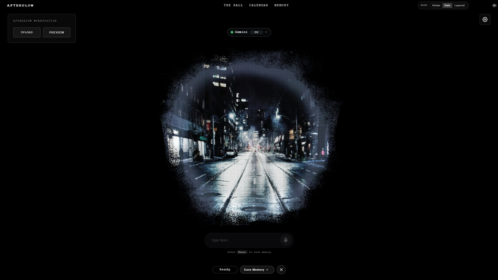
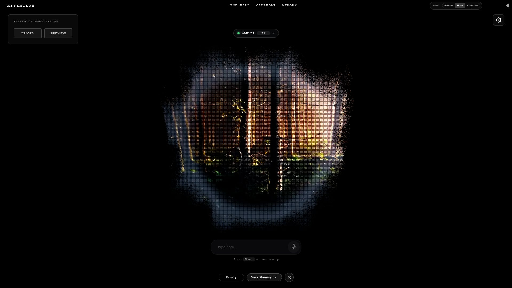

# Afterglow

A local-first memory app where photos dissolve into immersive 3D particle scenes, and AI helps turn fleeting moments into revisitable memories.

> Inspired by 秒秒Guo on Xiaohongshu. Rebuilt as a solo project with my own visual styling, UI decisions, and implementation approach.

**[→ Try the Live Demo](https://afterglow-44wh7wzan-noyolos-projects.vercel.app/)**
*(The public demo uses mocked AI responses.)*

---

## Preview

### Default Particle Scene


### Photo Particle Effect — Street



### Photo Particle Effect — Forest



### The Hall — Memory Gallery


### Calendar View


---

## Overview

Afterglow is a personal reinterpretation of a memory-palace style experience.

Instead of storing photos as a static gallery, the app transforms them into interactive 3D particle scenes. AI then helps the user recall, describe, and organize the story behind each moment. The result is a more emotional and immersive way to revisit personal memories.

While the overall concept and several major modules were inspired by an existing project direction, this version was independently rebuilt by me with my own UI styling, visual choices, and implementation decisions.

---

## What It Does

* Upload a photo and transform it into a 3D particle-based scene
* Use AI-guided prompts to reflect on and describe the memory
* Save each memory into a personal visual archive
* Revisit memories through **The Hall** gallery view
* Browse memories by date through the **Calendar**
* Switch between Chinese and English
* Use voice input for a more natural capture flow

---

## My Contribution

This project was built end-to-end by me as a solo project.

What I wanted to show through Afterglow was not that I invented the original product concept, but that I could study a strong reference, rebuild it from scratch, and turn that inspiration into a polished working experience. My main contribution in this version is the end-to-end implementation, visual presentation, UI styling, and the overall product polish.

---

## Why This Project Matters

Most photo apps store memories, but they rarely help people emotionally reconnect with them.

Afterglow explores a different direction: treating memory as an atmosphere, not just an image. The goal was to combine visual immersion, reflection, and lightweight AI assistance into a more meaningful personal experience.

This project reflects the kind of work I enjoy most: turning abstract creative ideas into something real, interactive, and usable.

---

## Key Features

* **Photo-to-particle visualization** — photos become immersive 3D particle compositions
* **Multiple visual modes** — different particle styles create different moods
* **AI-guided memory capture** — conversational prompts help shape vague recollections into words
* **The Hall** — a visual memory gallery for revisiting saved moments
* **Calendar browsing** — access memories through time, not just folders
* **Voice input** — capture thoughts more naturally
* **Local-first storage** — memories stay in the browser, with no account required
* **Chinese / English toggle**

---

## Tech Stack

| Layer        | Tech                      |
| ------------ | ------------------------- |
| Frontend     | Vite + Vanilla JavaScript |
| 3D Rendering | Three.js                  |
| Backend      | Node.js + Express         |
| AI           | Google Gemini API         |
| Storage      | IndexedDB                 |
| Deployment   | Vercel + Render           |

---

## Why Vanilla JS

The core of Afterglow is a full-screen visual scene built around WebGL and Three.js. The surrounding interface is intentionally minimal, so a lightweight setup made more sense than adding a heavy frontend framework.

---

## Why Local-First

Memories are personal, so I wanted the app to feel private and low-friction. Afterglow stores core memory data locally in the browser using IndexedDB, without requiring sign-up or a cloud account. For the public demo, AI responses are mocked; in the full version, Gemini can be connected with a user-provided API key.

---

## Run Locally

```bash
# Clone the project
git clone https://github.com/Noyolos/Afterglow.git
cd Afterglow

# Start frontend
npm install
npm run dev
```

In a second terminal:

```bash
cd server
npm install
echo "GEMINI_API_KEY=your_key" > .env
npm start
```

---

## Project Status

The project is functional and publicly deployed as a demo.
The live version uses mocked AI responses to keep it lightweight, while the local version supports full Gemini integration with a valid API key.

---

## Notes

This project is inspired by an existing creative concept, and several important modules follow that reference direction. What this version demonstrates is my ability to independently rebuild the experience, execute it end-to-end, and express my own taste through the UI, visual treatment, and final product polish.
